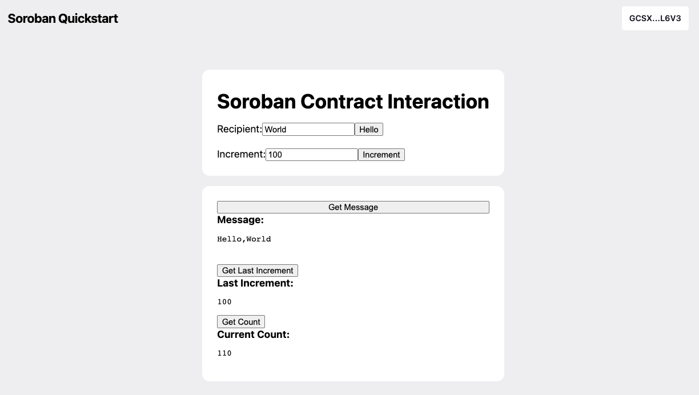

# Soroban Quickstart Dapp



This is a [Next.js](https://nextjs.org/) project, demoing how to build a dapp frontend
backed by smart contracts on Stellar.

# Getting Started

## Install Dependencies

1. `rustc` >= 1.71.0 with the `wasm32-unknown-unknown` target installed. See https://soroban.stellar.org/docs/getting-started/setup#install-rust . If you have already a lower version, the easiest way to upgrade is to uninstall (`rustup self uninstall`) and install it again.
2. `soroban-cli`. See https://soroban.stellar.org/docs/getting-started/setup#install-the-soroban-cli.
3. If you want to run everything locally: `docker` (you can run both Standalone and Futurenet backends with it)
4. Node.js v18
5. [Freighter Wallet](https://www.freighter.app/) ≥[v5.0.2](https://github.com/stellar/freighter/releases/tag/2.9.1). Or from the Firefox / Chrome extension store. Once installed, enable "Experimental Mode" in the settings (gear icon).
6. If you want to skip step (1) and (2) and avoid installing specific `rustc` or `soroban-cli` versions, build the `soroban-preview` docker image:

```
make build-docker
```

7. **NOTE** - Follow the instructions below for Futurenet or Standalone and ensure that you have funded your wallet address that you intend to use from browser, otherwise the dapp display will be blank and a 'Account not found' will be printed on browser's console only.

## Run Backend

Make sure to start from a clean setup:

```
npm run clean
```

You have three options: 1. Deploy on [Futurenet](https://soroban.stellar.org/docs/getting-started/deploy-to-futurenet) using a remote [RPC](https://soroban.stellar.org/docs/getting-started/run-rpc) endpoint, 2. run in [localnet/standalone](https://soroban.stellar.org/docs/getting-started/deploy-to-a-local-network) mode.

### Option 1: Deploy on Futurenet

1.  Deploy the contracts and initialize them

        npm run setup

    This runs `./initialize.sh futurenet` behind the scenes, which will create a `example-user` identity for you (`soroban config identity create example-user`) and deploy the [modified hello world contract](./contracts/hello-world), with this account as the deployer.

2.  Select the Futurenet network in your Freighter browser extension

### Option 2: Localnet/Standalone

0.  If you didn't yet, build the `soroban-preview` docker image, as described above:

    make build-docker

1.  In one terminal, run the backend docker containers and wait for them to start:

        ./quickstart.sh standalone

    You know that it fully started if it goes into a loop publishing & syncing checkpoints.

    You can stop this process with <kbd>ctrl</kbd><kbd>c</kbd>

2.  Keep that running, then deploy the contracts and initialize them:

    You can use your own local soroban-cli:

        NETWORK=standalone npm run setup

    Or run it inside the soroban-preview docker container:

        docker exec soroban-preview ./initialize.sh standalone

    **Note:** this state will be lost if the quickstart docker container is removed, which will happen if you stop the `quickstart.sh` process. You will need to re-run `./initialize.sh` every time you restart the container.

3.  Add the Standalone custom network in Freighter

    |                        |                                    |
    | ---------------------- | ---------------------------------- |
    | Name                   | Standalone                         |
    | URL                    | http://localhost:8000/soroban/rpc  |
    | Passphrase             | Standalone Network ; February 2017 |
    | Allow HTTP connection  | Enabled                            |
    | Switch to this network | Enabled                            |

4.  Add some Standalone network lumens to your Freighter wallet.

    1. Copy the address for your freighter wallet.
    2. Visit `http://localhost:8000/friendbot?addr=<your address>`

## Frontend

Now that you're running the backend, you can run the development server:

    npm run dev

Open [http://localhost:3000](http://localhost:3000) with your browser to see the result.

# User Workflows

The contract dev should be able to:

- Clone the example repo (this one)
- Deploy their contract to futurenet
- Deploy a soroban rpc server somewhere (TBD)
- Deploy the example web ui somewhere (e.g. netlify)

Then via the web UI, users should be able to:

- Connect their wallet (freighter for now)
- See their message, last increment, and current count
- "Live"-Update the page with the last increment, count and message
